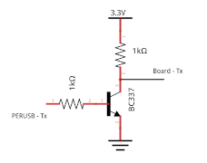
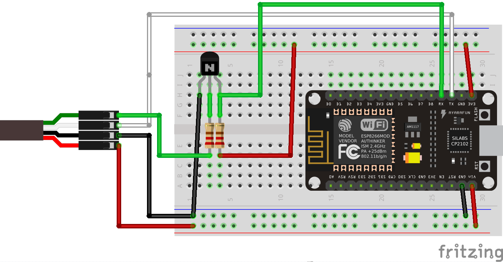
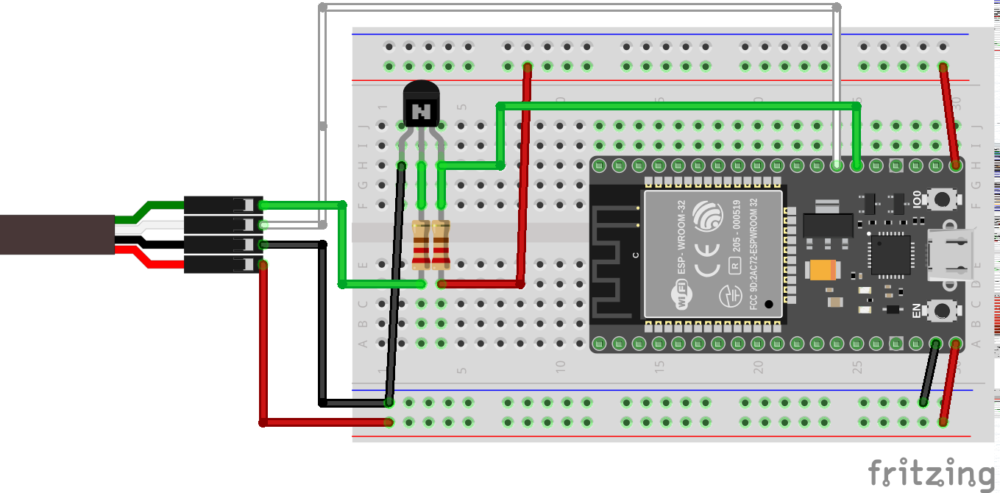
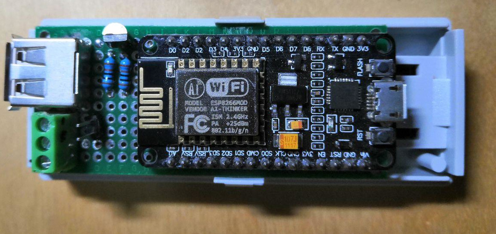

# Mikromarz gateway
ESP32 / ESP8266 library for reading data from MikroMarz devices. MikroMarz devices use 'PERUSB' interface for communicate between electricity meter and network gateway.

Tested on ESP8266 (NodeMCU) and ESP32 (ESP-WROOM-32)

Supported MikroMarz devices:
- [SE1-PM2](https://www.mikromarz.com/www-mikromarz-cz/eshop/51-1-Elektromery/179-2-3-fazove-elektromery/5/690-3-fazovy-2-tarifni-elektromer-SE1-PM2)
- [SD1_PM1](https://www.mikromarz.com/www-mikromarz-cz/eshop/51-1-Elektromery/0/5/156-Elektromer-SD1-PM1)

### PERUSB:
The physical interface is standard USB. Ground (black wire) and +5V (red wire) are on the standards pins.
This interface uses UART for communication on data pins (127 659 bits/s, SERIAL_8E1). Unfortunately, the receive signal is inverted.

#### Inverter
We can use transistor [BC337](https://www.mouser.com/datasheet/2/149/BC337-193546.pdf) + 2x 1kΩ resistors.

---
## ESP8266
This board has got only one full UART (Rx, Tx) and one partial UART (Tx). We have to use inverter for reading data from device.
- UART0 (TX = GPIO1, RX = GPIO3) - electricity meter
- UART1 (TX = GPIO2) - optional debug monitor

### ESP32
This board has got three full UARTs. The using of the inverter is optional.

Variant with inverter:
- UART1 (TX = GPIO17, RX = GPIO16) - electricity meter

Variant without inverter:
- UART1 (TX = -1, RX = GPIO16) - electricity meter
- UART2 (TX = GPIO17, RX = -1) - electricity meter

### Gateway

## License

The MIT License (MIT)

Copyright (c) 2020 BlackSmith
